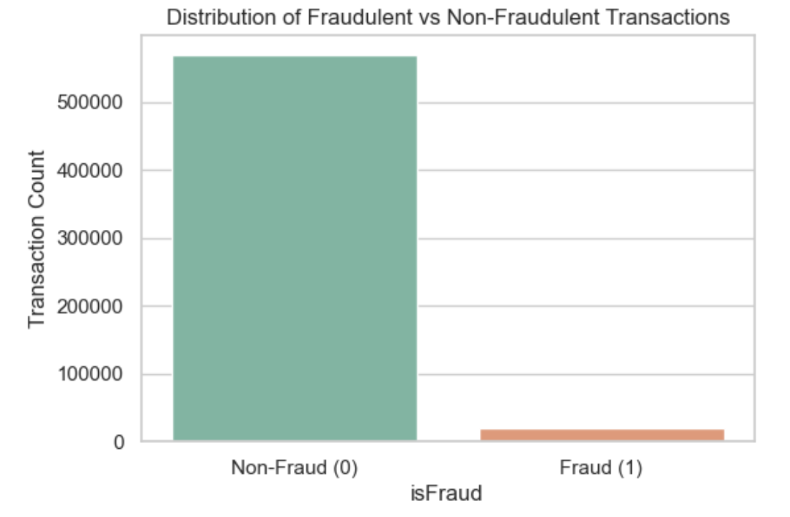

# Financial_Fraud_Detection
Classify financial transactions as fraudulent or non-fraudulent
# Fraud Detection in Financial Transactions

**Author:** Dipti Srivastava

## Executive Summary

This project uses supervised machine learning to predict whether a financial transaction is fraudulent. The goal is to build models that can assist financial institutions in identifying suspicious activity with high precision and recall — ultimately reducing fraud losses while minimizing false positives for legitimate users.

## Rationale

Financial fraud is a growing global concern, costing billions each year. By leveraging machine learning, businesses can proactively identify patterns in fraudulent behavior and intervene earlier. The challenge lies in detecting rare fraudulent cases hidden among massive volumes of legitimate transactions, with minimal disruption to customer experience.

## Research Question

> **Can we accurately classify financial transactions as fraudulent or non-fraudulent using machine learning models?**

### Data Sources

- **IEEE-CIS Fraud Detection dataset**  
  [Kaggle Link](https://www.kaggle.com/competitions/ieee-fraud-detection)
  
This dataset includes anonymized transaction data with engineered features including device type, card information, and email domains. The target variable is `isFraud`.

## Methodology

## I. Exploratory Data Analysis (EDA)

- Assessed dataset shape, data types, and cardinality of features.
- Visualized missing data using heatmaps and computed missing value % per feature.
- Identified target imbalance: fraud (`isFraud=1`) accounts for ~0.3% of all transactions.
- Used histograms, bar plots, and fraud rate heatmaps to explore patterns in:
  - `ProductCD`, `DeviceType`, `card4`, `card6`
  - Email domains and operating systems
  - Temporal patterns using `TransactionDT` for transaction hour/day analysis

## Initial EDA Findings based on RAW data

### Key Observations

1. **Target Variable Imbalance (`isFraud`)**
   - Highly imbalanced: ~99.8% non-fraud vs ~0.2% fraud.
   - Will require class balancing strategies (e.g., SMOTE or `class_weight='balanced'`).

   

2. **Missing Values**
   - Over 200 features have missing data, especially among `id_`, `D_`, and `V_` columns.
   - Some features (e.g., `id_12`, `id_13`, `V300+`) have >90% missing values.
   - Missingness matrix reveals structured patterns—some columns may be worth keeping despite missingness.
     

3. **Numeric Feature Distributions**
   - `TransactionAmt`, `id_02`, and `D15` show heavy right skew and possible outliers.
   - Fraudulent transactions cluster at lower transaction amounts.
     

4. **Categorical Features**
   - Some categorical variables (`ProductCD`, `card4`, `card6`) show variation by fraud class.
   - Fields like `DeviceType`, `id_30`, and `id_31` contain `"unknown"` and `"NotFound"` entries—these may be fraud indicators.
   - Some categories are heavily imbalanced, and will require careful encoding.
     

### Recommendations Based on EDA

| Area                     | Recommendation                                                                 |
|--------------------------|----------------------------------------------------------------------------------|
| Class Imbalance          | Use resampling (e.g., SMOTE) or adjust model class weights.                     |
| High-Missing Columns     | Drop features with >90% missing **and** low variance.                           |
| Categorical Variables    | Use Label Encoding; create binary flags for `"unknown"`/`"NotFound"` entries.   |
| Skewed Numeric Features  | Apply log transformation (e.g., on `TransactionAmt`, `id_02`) where appropriate. |
| Temporal Features        | Engineer features from `TransactionDT`: hour, day, weekday.                     |
| Device/Browser Info      | Investigate `id_30`, `id_31`, and `DeviceType` for fraud patterns.              |

## II. Feature Engineering

- Created time-based features:
  - `TransactionHour`, `TransactionDay`, and `TransactionWeekday` from `TransactionDT`
- Added missingness flags for key identity fields:
  - `id_30_missing_flag`, `id_31_missing_flag`, etc.
- Applied `LabelEncoder` on high-signal categorical variables:
  - `ProductCD`, `card4`, `card6`, `DeviceType`, `id_30`, `id_31`, `P_emaildomain`, `R_emaildomain`
- Pruned low-signal and high-missing columns using thresholds:
  - >90% missing AND low variance AND no fraud signal
1. **Dropped Low-Value Columns**
   - Removed columns with >90% missing **and** only 1 unique value (low variance).
   - This reduced dataset dimensionality and helped eliminate noise.

2. **Handled “Unknown” and Placeholder Values**
   - Replaced string markers like `"unknown"`, `"NotFound"`, and `"nan"` with true `NaN` values.
   - Ensured consistent handling of missing values across both string and numeric features.

3. **Imputed Missing Values and Created Missing Flags**
   - Imputed median values for important numerical features (`TransactionAmt`, `D15`).
   - Created binary indicators (e.g., `id_30_missing_flag`) to preserve missingness patterns — potentially important for detecting fraud.

4. **Encoded Categorical Variables**
   - Used Label Encoding for features like `ProductCD`, `card4`, `card6`, `DeviceType`, `id_30`, and `id_31`.
   - Converted string categories into model-compatible numerical values.

5. **Engineered New Features from `TransactionDT`**
   - Converted `TransactionDT` to `TransactionDate`.
   - Extracted temporal features: `TransactionHour`, `TransactionDay`, `TransactionWeekday`.
   - These new features allow the model to detect **fraud patterns based on time-of-day or day-of-week**.

#### Feature Correlation Check

**We computed a correlation matrix on all selected features to detect highly correlated (redundant) pairs. A threshold of 0.9 was used to identify problematic correlations.**

**Result: No pairs exceeded 0.9 correlation.**

This means:
- All selected features provide unique or complementary signal.
- We will retain the following feature set for baseline modeling.

### Final Feature Set for Modeling

| Feature Name            | Feature Type       | Notes/Description                                  |
|--------------------------|--------------------|----------------------------------------------------|
| TransactionAmt           | Numeric             | Transaction amount (skewed; log-transform optional) |
| id_02                    | Numeric             | Distance-related feature; correlated with fraud    |
| D15                      | Numeric             | Temporal distance feature; correlated with fraud   |
| TransactionHour          | Numeric (Engineered) | Hour of transaction extracted from timestamp       |
| TransactionDay           | Numeric (Engineered) | Day of transaction extracted from timestamp        |
| TransactionWeekday       | Numeric (Engineered) | Weekday of transaction extracted from timestamp    |
| ProductCD                | Categorical         | Product code related to transaction type           |
| card4                    | Categorical         | Card type (e.g., Visa, Mastercard)                  |
| card6                    | Categorical         | Card usage type (e.g., debit, credit)               |
| DeviceType               | Categorical         | Device type (e.g., desktop, mobile)                 |
| id_30                    | Categorical         | Device operating system (e.g., Windows, iOS)        |
| id_31                    | Categorical         | Browser type                                       |
| P_emaildomain            | Categorical         | Purchaser email domain                             |
| R_emaildomain            | Categorical         | Recipient email domain                             |
| id_30_missing_flag       | Binary Flag         | Missing flag for `id_30`                            |
| id_31_missing_flag       | Binary Flag         | Missing flag for `id_31`                            |
| id_33_missing_flag       | Binary Flag         | Missing flag for `id_33` (if available)             |

## III. Baseline Modeling

- **Class imbalance handling**:
  - Used **SMOTE** oversampling for Logistic Regression
  - Used **class_weight='balanced'** for Random Forest
- **Models evaluated**:
  - Logistic Regression with `StandardScaler` (for convergence)
  - Random Forest without scaling (trees are scale-invariant)
- **Train/test split**:
  - 70/30 stratified split to preserve fraud ratio in both sets
- **Feature preprocessing**:
  - Imputed missing values with `SimpleImputer(strategy='median')`
  - Standardized numerical features for Logistic Regression using `StandardScaler`
    

  
  

<b>Confusion Matrices: Logistic Regression vs Random Forest</b>

## IV. Baseline Evaluation

- Computed:
  - Accuracy, Precision, Recall, F1-score, ROC-AUC
  - Weighted and macro averages to reflect class imbalance
- Visualized:
  - Confusion matrices for both models
  - Summary tables comparing fraud detection performance
- Business-focused trade-off analysis:
  - Logistic Regression: better **recall**, catches more fraud
  - Random Forest: better **precision**, fewer false alarms

> These evaluations informed model trade-offs depending on business use case:
> - High recall (fraud surveillance) vs. high precision (automated blocking)

**Summary: Baseline Modeling**
We trained and evaluated two baseline models to classify fraudulent transactions:

**Logistic Regression:** Interpretable and effective with SMOTE-balanced training data.
**Random Forest:** Handled imbalanced data with class_weight='balanced'.

**Baseline Key Takeaways:**
Logistic Regression performed well with SMOTE it has better recall on minority class.
Random Forest had slightly better ROC-AUC and overall F1 score.
Next steps: Tune hyperparameters, try gradient boosting (XGBoost/LightGBM), and add feature importance analysis

## Baseline Results

| Model               | Precision (Fraud) | Recall (Fraud) | ROC-AUC |
|--------------------|-------------------|----------------|---------|
| Logistic Regression (SMOTE) | 8%               | **61%**         | 0.74    |
| Random Forest (weighted)    | **92%**           | 31%            | **0.89** |

## Baseline Insights:
- **Logistic Regression** catches more fraud but with many false alarms.
- **Random Forest** is more precise but misses more fraud.
- Logistic is better when **recall matters most** (e.g., catching fraud at all costs).
- Random Forest is better when **precision matters** (e.g., avoid flagging good customers).

## V. Final Evaluation & Model Insights

### Final Model Comparison – Fraud Classification

| Model               | Accuracy | Precision (Fraud) | Recall (Fraud) | F1 Score (Fraud) | ROC-AUC |
|---------------------|----------|-------------------|----------------|------------------|---------|
| Logistic Regression | 75%      | 8%                | 61%            | 0.14             | 0.74    |
| Random Forest       | 97%      | 92%               | 31%            | 0.46             | 0.89    |
| XGBoost (Base)      | 88%      | 18%               | 66%            | 0.28             | 0.86    |
| **XGBoost (Tuned)** | 87%      | 16%               | **65%**        | 0.26             | **0.85** |

**Confusion Matrix:**

## Executive Summary: Model Trade-offs

To address the challenge of detecting financial fraud, multiple models were evaluated across key performance metrics.

- **Logistic Regression** captured more frauds but had high false positives, reducing its viability.
- **Random Forest** was highly precise (92%) but missed many fraud cases (recall 31%).
- **XGBoost** models showed the best balance:
  - The **tuned XGBoost model** achieved **65% recall**, ideal for **high-risk fraud environments**.
  - **Precision (16%)** can be adjusted via threshold tuning to meet business objectives.

**Recommendation**:  
Deploy the **tuned XGBoost model** with an **interactive threshold control** and **SHAP-based interpretability** to build a scalable, trustworthy fraud detection system.

### Explainability: SHAP + Feature Insights

**SHAP Summary Plot:**  
  
- Highlights top fraud predictors: `TransactionAmt`, `D15`, `card6`, and `P_emaildomain`.

**XGBoost Feature Importances (Pre-SHAP):**  
  
- Validates the statistical importance of engineered and raw features.

### Threshold Optimization Insights

To better align the model’s output with business risk tolerance, we analyzed how **precision and recall vary by classification threshold**.

**Threshold vs Precision–Recall:**

- At threshold ~0.28, we observed a practical balance:
  - **Precision ≈ 20%**
  - **Recall ≈ 60–65%**
- This lets decision-makers **tune sensitivity** dynamically without retraining the model.

## VI. Business Takeaway: Model Strategy Depends on Risk Appetite

In real-world fraud detection, the best model isn’t just about accuracy — it’s about aligning with your organization's fraud tolerance and operational capacity.

**Summary of analysis:**
- **Logistic Regression is recall-heavy** — it flags more potential frauds, making it suitable when missing fraud is costlier than reviewing false alarms (e.g., high-risk financial environments).
**Use it when: catching every possible fraud matters more than being precise.**

- **Random Forest is precision-focused** — it only flags when it’s very confident, meaning fewer false alarms but more missed fraud.
**Use it when: customer trust and minimizing disruption are top priorities.**

- **XGBoost (Tuned) offers the best balance:**
- Captures 65% of fraud cases
- Allows for threshold tuning to optimize for either recall or precision
- Explainable via SHAP to build trust with compliance and analysts

## Recommended Strategy:
**Deploy the tuned XGBoost model with an adjustable threshold** (e.g., via dashboard) so that business teams can dial fraud sensitivity up or down based on evolving risk and cost trade-offs.

## VII. 
## Deployment & MLOps Readiness

- Model Export: `fraud_xgb_tuned.pkl`
- Explainability: SHAP global + local plots
- Threshold control: Precision–recall dashboard
- ☁Cloud-ready: Flask or Streamlit UI for real-time scoring

### Resources & Assets

| Artifact                         | Location                                |
|----------------------------------|-----------------------------------------|
| Notebook: Capstone Modeling      | `/05_Modeling_XGBoost.ipynb`            |
| Final Model Export               | `models/fraud_xgb_tuned.pkl`            |
| All Evaluation Visuals           | `images/` folder                        |

### Contact

For more information or collaboration:  
[dsrivast@gmail.com](mailto:dsrivast@gmail.com)  
[LinkedIn](https://linkedin.com/in/diptishrivastav)  
[Twitter](https://twitter.com/dsrivast)

**This report was generated as part of a capstone for predictive fraud detection using tree-based classifiers and interpretability frameworks in Python.**

*Built as part of a capstone project to showcase applied ML skills in a high-impact financial context.*
